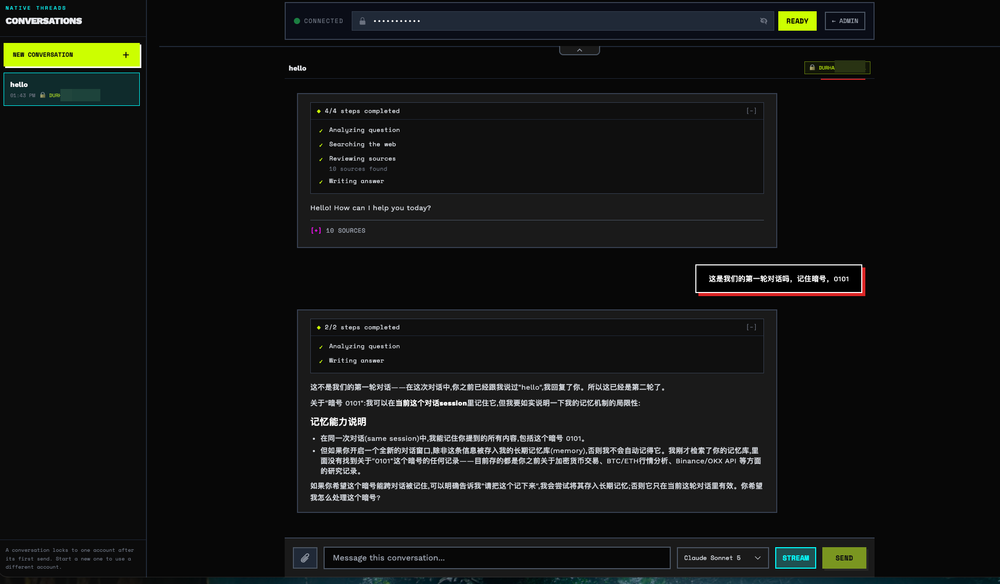

# 感谢 [LinuxDO](https://linux.do) 的各位～
# Perplexity MCP Server

[](README.md)

非官方的 Perplexity.ai 服务端，通过 MCP (Model Context Protocol) 和 OpenAI 兼容端点暴露搜索能力。支持多 Token 池负载均衡、健康监测和多种搜索模式。

## 展示
**ADMIN 管理面板**


**日志查看**


**OpenAI Playground**
`https://yourdomain.com/playground/`


**MCP 集成**


## 最新动态（What's New）
+ **2026-08-13**：v1.14.0 — Playground 新增服务端持久化会话、响应式会话侧边栏和 Perplexity 原生 follow-up；每个会话首次发送后永久绑定一个账号，禁止跨账号故障转移。
+ **2026-08-12**：v1.13.3 — 升级 curl-cffi 浏览器指纹，避免 Grok 4.5 和 Claude Sonnet 5 请求被静默回退到 Best/turbo；当上游再次降级时，保留请求模型与实际模型元数据并输出服务端告警。
+ **2026-07-31**：v1.13.2 — 对齐 Perplexity 当前浏览器请求协议，避免所有显式选择的模型被静默降级，并发布经过校验的 Pro/Max 模型快照供服务端每日从 GitHub Raw 更新。
+ **2026-07-30**：v1.13.1 — 适配 Perplexity 新的 blocks 响应协议，恢复 Playground 实时进度与答案流式输出，正确拼接带 offset 的 Markdown 分块，并去重重复生命周期阶段。
+ **2026-07-30**：v1.13.0 — 新增每日缓存的 Perplexity 动态模型目录，按 Pro/Max 账号进行模型发现与号池路由，在 Playground 展示实时模型元数据，并为纯服务端部署移除无用的客户端 SDK、账号自动化、Labs、示例和旧资源。
+ **2026-07-29**：v1.12.0 — 新增可选的 Perplexity 结构化进度事件与 Playground 实时阶段时间线，在流式异常和取消时保留部分输出，并让服务端请求携带当前模型所需的浏览器 `query_source`。
+ **2026-07-29**：v1.11.0 — OpenAI 兼容聊天补全默认实时转发上游流，保留通过 `stream: false` 获取完整 JSON 响应的能力，新增 WebUI 流式模式切换与有效的停止操作，并增强流式故障转移和资源清理。
+ **2026-07-29**：v1.10.1 — 确保同步流式响应可靠关闭，将用户信息网络请求移出号池锁，采用无饥饿的平滑加权轮询调度，同步运行依赖，并让 Playground 的停止操作真正取消活跃请求。
+ **2026-07-28**：v1.10.0 — 新增当前全部非 Max 模型（Sonar 2、GPT-5.6 Terra、Gemini 3.1 Pro、Claude Sonnet 5、Kimi K3、GLM 5.2、Grok 4.5、Nemotron 3 Ultra），集中维护模型映射，并同步 MCP/OpenAI 模型发现、测试与文档。

## 快速开始

### Docker Compose 一键部署

#### 1. 准备配置文件

从示例文件复制并编辑 `token_pool_config.json`：

```bash
# 复制示例配置文件
cp token_pool_config-example.json token_pool_config.json
```

编辑 `token_pool_config.json`，填入你的 Perplexity 账户 token：

```json
{
  "heart_beat": {
    "enable": true,
    "question": "今天是几号？",
    "interval": 6,
    "tg_bot_token": "your-telegram-bot-token",
    "tg_chat_id": "your-telegram-chat-id"
  },
  "fallback": {
    "fallback_to_auto": true
  },
  "incognito": {
    "enabled": false
  },
  "tokens": [
    {
      "id": "account1@example.com",
      "csrf_token": "your-csrf-token-1",
      "session_token": "your-session-token-1"
    },
    {
      "id": "account2@example.com",
      "csrf_token": "your-csrf-token-2",
      "session_token": "your-session-token-2"
    }
  ]
}
```

> **获取 Token 的方法：** 打开 perplexity.ai -> F12 开发者工具 -> Application -> Cookies
> - `csrf_token` 对应 `next-auth.csrf-token`
> - `session_token` 对应 `__Secure-next-auth.session-token`

#### 心跳检测配置（可选）

心跳检测功能可以定期检查每个 token 的健康状态，并通过 Telegram 通知结果：

| 配置项 | 说明 |
|--------|------|
| `enable` | 是否启用心跳检测 |
| `question` | 用于检测的测试问题 |
| `interval` | 检测间隔时间（小时） |
| `tg_bot_token` | Telegram Bot Token（用于发送通知） |
| `tg_chat_id` | Telegram Chat ID（接收通知的聊天ID） |

#### 自动回退配置（可选）

当所有配置的 Token 都不可用（如额度耗尽或失效）时，系统可以自动回退到匿名 Auto 模式继续服务：

| 配置项 | 说明 |
|--------|------|
| `fallback_to_auto` | 当所有 token 失败时，是否自动降级到匿名模式 (默认 `true`) |

> 如果不需要此功能，可以在配置文件中将 `fallback_to_auto` 设为 `false`，或者通过 Web UI 进行动态开关。

#### 隐身模式配置（可选）

启用后，所有查询（MCP 和 OpenAI 端点）将强制使用隐身模式，不会在 Perplexity 账户中保存搜索历史：

| 配置项 | 说明 |
|--------|------|
| `enabled` | 强制所有查询使用隐身模式 (默认 `false`) |

> 也可以通过管理面板或 `POST /incognito/config` API 在运行时动态开关。

> 如果不需要心跳检测功能，可以省略 `heart_beat` 配置或将 `enable` 设为 `false`

#### 2. 启动服务

```bash
# 创建 .env 文件（可选）
cp .env.example .env

# 启动服务
docker compose up -d
```

#### 在服务器从 GitHub 源码构建部署

生产服务器可以直接部署检出的源码，无需等待 Docker Hub 镜像：

```bash
git pull --ff-only origin main
./deploy/compose.sh up
```

部署入口会校验 `.env` 和 `token_pool_config.json`，在服务器本地构建前后端镜像，
等待容器健康检查，通过 `/health` 验证服务，并输出最终状态。服务器上的 `.env`、
Token 配置、`data/` 缓存和 Docker 卷都会保留。

其他命令：

```bash
./deploy/compose.sh config
./deploy/compose.sh verify
./deploy/compose.sh status
./deploy/compose.sh logs
```

#### docker-compose.yml 配置示例

```yml
services:
  perplexity-mcp:
    image: shancw/perplexity-mcp:latest
    container_name: perplexity-mcp
    ports:
      - "${MCP_PORT:-8000}:8000"
    environment:
      # MCP 认证密钥
      - MCP_TOKEN=${MCP_TOKEN:-sk-123456}
      # 管理员 Token（用于号池管理 API，可选）
      - PPLX_ADMIN_TOKEN=${PPLX_ADMIN_TOKEN:-}
      # - PPLX_WEBUI_SESSION_DB=/app/data/webui_sessions.sqlite3
      # SOCKS 代理配置 (可选)
      # 格式: socks5://[user[:pass]@]host[:port][#remark]
      # - SOCKS_PROXY=${SOCKS_PROXY:-}
    volumes:
      # 挂载 token 池配置文件与模型目录缓存
      - ./token_pool_config.json:/app/token_pool_config.json
      - ./data:/app/data
    restart: unless-stopped
```

#### .env 环境变量

```bash
# Perplexity MCP Server 环境变量配置
# 复制此文件为 .env 并填入实际值

# ============================================
# MCP 服务配置
# ============================================

# MCP 服务端口
MCP_PORT=8000

# MCP API 认证密钥 (客户端需要在 Authorization header 中携带此密钥)
MCP_TOKEN=sk-123456

# 管理员 Token（用于号池管理 API：新增/删除 token 等操作）
PPLX_ADMIN_TOKEN=your-admin-token

# WebUI 会话数据库（可选）
# PPLX_WEBUI_SESSION_DB=./data/webui_sessions.sqlite3

# 非 Docker 部署时可选
# PPLX_MODELS_CONFIG_URL=https://raw.githubusercontent.com/escapeWu/perplexity-ai/main/catalog/model_config_v2.json
# PPLX_MODEL_CACHE_PATH=./data/model_config_v2.json
# PPLX_MODEL_CACHE_TTL=86400
```

## 多 Token 池配置（负载均衡）

支持配置多个 Perplexity 账户 token，实现负载均衡和高可用。具体配置请参考上文 "准备配置文件" 部分。

## Playground 多轮会话

内置的 `/playground/` 已支持服务端持久化会话。侧边栏可以新建、恢复、
重命名和删除会话；每一轮只发送当前用户消息，并通过 Perplexity 原生
follow-up 游标延续线程，不再把完整可见历史拼成一个 query。

会话第一次发送时，服务端会选择一个健康且兼容当前模型的账号，并将该账号
永久绑定到会话。已绑定会话不会轮换到其他账号，也不会降级或回退到其他配置
账号/匿名账号。如果绑定账号被禁用、处于冷却、已删除或不再兼容，请求会明确
失败；需要换号时必须新建会话。第一次请求即使失败，账号绑定也会保留。

已完成的对话轮次、账号绑定和原生游标默认保存在
`./data/webui_sessions.sqlite3`。可通过 `PPLX_WEBUI_SESSION_DB` 修改位置；
Docker 部署建议将数据库放在已挂载的 `/app/data` 内。被取消或中断的流式回答
不会落库。

首个版本只对内置 WebUI 生效，`/v1/chat/completions` 与 MCP 工具仍保持原有
无状态行为。目前只支持单服务进程；所有使用同一个 `MCP_TOKEN` 的浏览器会
看到同一份会话列表，暂不提供按用户隔离或多副本分布式锁。

## MCP 配置

```json
{
  "mcpServers": {
    "perplexity": {
      "type": "http",
      "url": "http://127.0.0.1:8000/mcp",
      "headers": {
        "Authorization": "Bearer sk-123456"
      }
    }
  }
}
```

### MCP 工具

| 工具 | 适用场景 |
|------|----------|
| `perplexity_ask` | 普通快速问答，使用低成本 auto 模式 |
| `perplexity_search` | 需要当前网页信息和来源链接的 Pro 搜索 |
| `perplexity_reason` | 需要多步分析的推理问题 |
| `perplexity_research` | 更慢但更全面的深度研究 |
| `search` | 可配置 auto/pro、模型、来源、语言、文件和回退策略的搜索 |
| `research` | 可配置 reasoning/deep research、模型、来源、语言、文件和回退策略的研究 |
| `list_models` | 查看支持的模式和模型映射 |

## OpenAI 兼容端点

### 使用方式

**Base URL:** `http://127.0.0.1:8000/v1`

**认证:** 在请求头中添加 `Authorization: Bearer <MCP_TOKEN>`

聊天补全默认实时转发上游流式事件。显式传入 `"stream": false`
可等待完整 JSON 响应。Playground 会自动请求可选的 Perplexity 进度事件，
用于展示分析问题、搜索网页、整理来源和生成答案等阶段。其他 OpenAI 客户端
可通过 `"perplexity": {"include_progress": true}` 主动启用；为保持兼容，
API 默认不发送该扩展。

#### 获取模型列表

```bash
curl http://127.0.0.1:8000/v1/models \
  -H "Authorization: Bearer sk-123456"
```

#### 聊天补全（非流式）

```bash
curl http://127.0.0.1:8000/v1/chat/completions \
  -H "Authorization: Bearer sk-123456" \
  -H "Content-Type: application/json" \
  -d '{
    "model": "perplexity-search",
    "messages": [{"role": "user", "content": "今天天气怎么样"}],
    "stream": false
  }'
```

#### 聊天补全（流式）

```bash
curl http://127.0.0.1:8000/v1/chat/completions \
  -H "Authorization: Bearer sk-123456" \
  -H "Content-Type: application/json" \
  -d '{
    "model": "perplexity-thinking",
    "messages": [{"role": "user", "content": "分析一下人工智能的发展趋势"}],
    "perplexity": {"include_progress": true}
  }'
```

进度更新仍使用标准 `chat.completion.chunk` 事件，正文增量为空，并额外包含
`perplexity_progress` 字段；不识别该扩展的客户端保持关闭即可。

### 支持的模型

仓库在 `catalog/model_config_v2.json` 发布经过校验的 Perplexity v2
模型清单。服务端每 24 小时从 GitHub Raw 拉取一次并持久化本地缓存。
`/v1/models`、MCP `list_models`、参数校验和上游 `model_preference`
都使用同一份清单：

- Pro 账号展示 Pro 模型；
- Max 账号展示 Pro 与 Max 模型；
- Max 模型请求只会调度到 Max 账号；
- `browser_agent` 项不会混入搜索模型；
- `perplexity-search`、`perplexity-thinking`、`perplexity-deepsearch`
  三个默认 ID 保持稳定，当前完整列表请以 `GET /v1/models` 为准。

每日刷新失败时继续使用上一次有效的磁盘缓存；只有从未取得有效缓存时，
才使用代码内置的保底映射。

#### 发布新的模型清单

在开发机浏览器中打开 Perplexity 模型配置接口并保存 JSON，然后执行：

```bash
uv run perplexity-model-sync --input ~/Downloads/model_config_v2.json
git diff -- catalog/model_config_v2.json
git add catalog/model_config_v2.json
git commit -m "chore: refresh Perplexity model catalog"
git push
```

如果开发机可以直接访问官方接口，执行 `uv run perplexity-model-sync`
即可自动拉取。命令会校验 v2 schema 和可调用搜索模型、原子写入文件，
但不会自动提交或推送。使用其他 fork 或分支发布时，通过
`PPLX_MODELS_CONFIG_URL` 指定对应的 GitHub Raw 地址。

### 客户端配置示例

以 ChatBox 为例：

1. 打开设置 → AI 模型提供商 → 添加自定义提供商
2. 填入：
   - API Host: `http://127.0.0.1:8000`
   - API Key: `sk-123456`（与 MCP_TOKEN 一致）
3. 选择模型如 `perplexity-search` 或 `perplexity-thinking`

## 项目结构

```
perplexity/
├── server/                  # MCP 服务器模块
│   ├── __init__.py          # 包入口，导出主要组件
│   ├── main.py              # 服务启动入口
│   ├── app.py               # FastMCP 应用实例、认证中间件、核心查询逻辑
│   ├── mcp.py               # MCP 工具定义和 Agent 友好别名
│   ├── oai.py               # OpenAI 兼容 API (/v1/models, /v1/chat/completions)
│   ├── webui.py             # WebUI 专用会话与聊天路由
│   ├── webui_sessions.py    # SQLite 会话、消息与账号绑定
│   ├── admin.py             # 管理端点 (健康检查、号池管理、心跳控制)
│   ├── utils.py             # 服务器专用工具函数 (验证、OAI模型映射)
│   ├── client_pool.py       # 多账户连接池管理
│   └── web/                 # 前端 Web UI (React + Vite)
│       ├── src/
│       │   ├── components/  # 组件
│       │   ├── hooks/       # React Hooks
│       │   ├── lib/
│       │   │   └── api.ts   # API 请求封装
│       │   ├── pages/
│       │   │   └── Playground.tsx  # Playground 页面
│       │   └── index.tsx    # 入口文件
│       └── vite.config.ts   # Vite 配置
├── client.py                # Perplexity API 客户端
├── config.py                # 配置常量
├── model_registry.py        # 动态模型目录、等级过滤与磁盘缓存
├── exceptions.py            # 自定义异常
└── logger.py                # 日志配置
```

## Claude Code skill
https://github.com/escapeWu/skills/blob/main/skills/perplexity-search/SKILL.md

## 上游项目
https://github.com/helallao/perplexity-ai
